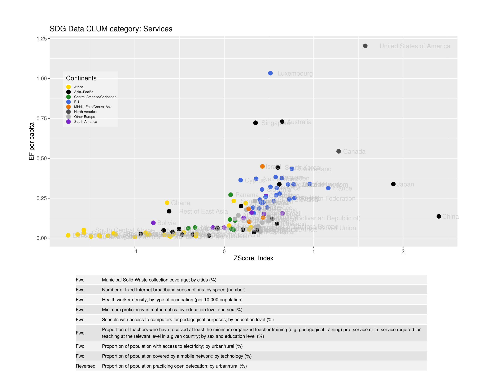

```{r setup, include=FALSE}
knitr::opts_chunk$set(echo=FALSE, warning=FALSE, message=FALSE,fig.width=12, fig.height=8)

"Note that the `echo = FALSE` parameter was added to the code chunk to prevent printing of the R code that generated the plot."
library(ggplot2)
library(grid)
library(gridExtra)
library(knitr)
library(kableExtra)
```


## Abstract  
(last)  

##  Introduction  
The Ecological Footprint (EF) measures human demand and supply of renewable biological resources, but does not give information on the quality of services provided as a result of that demand.    
Low demand can be due to high efficiency or low quality of life...  
Combining national Ecological Footprint results with the UN's Human Development Index (HDI) combined with the Ecological Footprint gives an overview into the global pattern of the provision of human welfare mapped against this demand for renewable resources.    

```{r HDI-EF graph, include=FALSE}
knitr::include_graphics
```
...(MRIO-FA) accounts use (EE-MRIO) to provide EF results related to activities.  (Brief description of MRIO This breaks down the total results in a way that differentiates that areas of life which are associated with different biocapcity demands by residents of different nations). Comparing across countries shows the range of demand for biocapacity by activity, but ...  
(Hypothesise that while x and y country have similar EF per capita for Food, one is likely more efficient with a high quality of food, while the other may be demanding less resources because there is a lack of sufficient quantity or quality of food for the residents).  
The Sustainable Development Goals (SDG) are…. An initiative to track nations’ progress toward these goals is the Sustainable Development Goals Indicators project (SDGI). The SDGI collect and organise available data which is relevant to the progress toward and achievement of these goals. Using these data, we identified….  

## Methods

### Ecological Footprint

### MRIO-FA
Input output tables.  
GTAP data  
EF allocation  
CLUM matrix  

### Sustainable Development Goals Indicator Data
SDG  
SDGIs  
A full list of Indicators and data as of the time of publication appears as an appendix to this paper (see: APPENDIX A)  
Our R script takes the most up-to-date data from the SDG API
Using principles of reproducible and open source science, the underlying scripts are available at... 
We select from the list of Indicator data.  
We normalize the data when there are multiple elements.  

## Results  
We found that combining EF by CLUM with appropriate SDGi data does differentiate countries according to variability in the quality of the consumption activities in each....  


```{r plots, include=TRUE, echo=FALSE}
#Set the minimum QScore to be included in the data
QScoreMin <- 4
#Pull the data from csv files
EFWBData <- read.csv("NFA_WB_2017_CLUM.csv")
EFSDGData <- read.csv("NFA_SDG_2017_CLUM.csv")
IndicatorsDownloaded <- read.csv("IndicatorsDLed.csv")
SDGIndicatorsDownloaded <- read.csv("SDGIndicatorsDownloaded.csv")
AllSDGiList <- read.csv("AllSDGiList.csv")

#subetted data to plot
EFWBData11 <- subset(EFWBData, (EFWBData$year == 2011 & EFWBData$QScore > QScoreMin))
EFSDGData11 <- subset(EFSDGData,(EFSDGData$year == 2011 & EFSDGData$QScore > QScoreMin))

EFWBData11.Food <- subset(EFWBData11, EFWBData11$clum7_name == "Food")
EFWBData11.Goods <- subset(EFWBData11, EFWBData11$clum7_name == "Goods")
EFWBData11.Government <- subset(EFWBData11, EFWBData11$clum7_name == "Government")
EFWBData11.Housing <- subset(EFWBData11, EFWBData11$clum7_name == "Housing")
EFWBData11.PersonalTransportation <- subset(EFWBData11, EFWBData11$clum7_name == "Personal Transportation")
EFWBData11.Services <- subset(EFWBData11, EFWBData11$clum7_name == "Services")

EFSDGData11.Food <- subset(EFSDGData11, EFSDGData11$clum7_name == "Food")
EFSDGData11.Goods <- subset(EFSDGData11, EFSDGData11$clum7_name == "Goods")
EFSDGData11.Government <- subset(EFSDGData11, EFSDGData11$clum7_name == "Government")
EFSDGData11.GrossFixedCapitalFormation <- subset(EFSDGData11, EFSDGData11$clum7_name == "Gross Fixed Capital Formation")
EFSDGData11.Housing <- subset(EFSDGData11, EFSDGData11$clum7_name == "Housing")
EFSDGData11.PersonalTransportation <- subset(EFSDGData11, EFSDGData11$clum7_name == "Personal Transportation")
EFSDGData11.Services <- subset(EFSDGData11, EFSDGData11$clum7_name == "Services")

plotfunc <- function(data, title, CLUMcat, IndDL, height1, height2){
  myColors <-   c("gold","black", "forestgreen", "royalblue", "darkorange2", "grey30", "grey70", "purple3")
  names(myColors) <- levels(data$Continents)
  colScale <- scale_colour_manual(name = "Continents",values = myColors)
  p <- ggplot(data, aes(ZScore_Index, total , colour = Continents)) +
    geom_point(size = 3) +
    geom_text(label = data$GTAP_name,hjust=-.2, alpha=0.55, colour="grey") +
    scale_x_continuous(breaks = c(min(data$ZScore_Index[!is.na(data$ZScore_Index)]),0,max(data$ZScore_Index[!is.na(data$ZScore_Index)])), labels = c("Lowest","", "Highest")) +
    colScale +
    labs(title = paste(title,"CLUM category:",data$clum7_name), y = "EF per capita") +
    theme(plot.margin = unit(c(1,2,1,1),"cm"), legend.position = c(.1,.7),
          legend.text = element_text(colour="black", size=6),
          legend.key.size = unit(.05,"cm"),
          legend.background = element_rect(fill=alpha ("white",0.4))) 
  gt <- ggplot_gtable(ggplot_build(p)) 
  gt$layout$clip[gt$layout$name == "panel"] <- "off" 
  
  
  tb <- tableGrob(cbind(as.character(IndDL[,5][IndDL$CLUM==CLUMcat]),
  stringr::str_wrap(as.character(IndDL[,3][IndDL$CLUM==CLUMcat]),400)),
                  theme = ttheme_default(base_size=8,
                                         core = list(fg_params=list(hjust=0, x=0))))
  
  # plotname <- paste("Plots/",deparse(substitute(data)),".pdf", sep ="")
  # pdf(plotname,width=12,height=9,onefile = FALSE)
  # dev.off
  grid.newpage()
  grid.arrange(gt, tb, nrow=2, heights = c(height1, height2), vp=viewport(width=0.95, height=0.95))
  #dev.off()
}
```


```{r Figure 1, echo=FALSE, eval = TRUE}
plotfunc(EFSDGData11.Food,"SDG Data", "Food", SDGIndicatorsDownloaded, 1.5, .5)
```


For the category measuring the Ecological Footprint of Food against our indicator data representing the quality of food provision in each country, 
```{r Testing plots, echo=FALSE, eval=FALSE}
# myColors <-   c("gold","black", "forestgreen", "royalblue", "darkorange2", "grey30", "grey70", "purple3")
# names(myColors) <- levels(EFSDGData11.Goods$Continents)
# colScale <- scale_colour_manual(name = "Continents",values = myColors)
# p <-ggplot(EFSDGData11.Goods, aes(ZScore_Index, total, colour = Continents)) +
#   geom_point(size = 3) +
#   geom_text(label = EFSDGData11.Goods$GTAP_name,hjust=-.2, alpha=0.55, colour="grey") +
#     colScale +
#     labs(title = paste("SDG Data","CLUM category:",EFSDGData11.Goods$clum7_name), y = "EF per capita") +
#     theme(plot.margin = unit(c(1,2,1,1),"cm"), legend.position = c(.1,.7),
#           legend.text = element_text(colour="black", size=6),
#           legend.key.size = unit(.05,"cm"),
#           legend.background = element_rect(fill=alpha ("white",0.4))) 
#   gt <- ggplot_gtable(ggplot_build(p)) 
#   gt$layout$clip[gt$layout$name == "panel"] <- "off" 
#   
#   
#   tb <- tableGrob(subset(SDGIndicatorsDownloaded[,3],SDGIndicatorsDownloaded$CLUM==CLUMcat),
#                   theme = ttheme_default(base_size=8,
#                                          core = list(fg_params=list(hjust=0, x=0))))
#   #plotname <- paste("Plots/",deparse(substitute(EFSDGData11.Goods)),".pdf", sep ="")
#   #pdf(plotname,width=12,height=9,onefile = FALSE)
#   #dev.off
#   grid.newpage()
#   grid.arrange(gt, tb, nrow=2, heights = c(1.5, .5))
#   #dev.off()

```
```{r Figure 2, echo=FALSE, eval=TRUE}
plotfunc(EFSDGData11.Goods,"SDG Data", "Goods",SDGIndicatorsDownloaded, 1.5, .5)
```

For the CLUM category of 'Goods', the results show highly clustered ... 

```{r Figure 3, echo=FALSE, eval=TRUE}
plotfunc(EFSDGData11.Housing,"SDG Data", "Housing", SDGIndicatorsDownloaded, 1.5, .5)
```

For the consumption category of Housing, ...  


```{r Figure 4, echo=FALSE, include = TRUE, eval=TRUE}
## PLOT HAS AN ERROR RIGHT NOW RE LINE LENGTH/WRAPPING  
##  plotfunc(EFSDGData11.Services,"SDG Data", "Serivces", SDGIndicatorsDownloaded, 1.5, .5)
# Working on a workaround....
## For PDF Version use
knitr::include_graphics("Plots/EFSDGData11.Services.pdf")
## For HTML Version use
#


# 
# 


```

For the Services consumption category, ...  

```{r Figure 5, echo=FALSE, eval=TRUE}

plotfunc(EFSDGData11.PersonalTransportation,"SDG Data", "Transport", SDGIndicatorsDownloaded, 1.5, .5)
```

For the Personal Transportation category, we can see that a fairly straight-forward proxy indicator of a single set of data gives a picture of the state and variability of different nations’ relative success in achieving safe and effective transport within ...  

```{r Figure 6, echo=FALSE, eval=TRUE}

plotfunc(EFWBData11.Government,"World Bank Data", "Government",IndicatorsDownloaded, 1, 1)

```

For the Government category, the SDG Indicator data did not provide appropriate data series with data for year in this study. Pulling directly from the World Bank data – which is the original data source for a few of the SDG Indicator data series – gives a robust picture of the provision of government services across countries. Interestingly, the pattern and distribution are similar at the continent level to that of the Ecological Footprint and the Human Development Indicator.

```{r Figure 7, echo=FALSE, eval=TRUE}

plotfunc(EFSDGData11.GrossFixedCapitalFormation,"SDG Data", "GFCF", SDGIndicatorsDownloaded, 1.5, .5)
```

Gross Fixed Capital Formation is a measure of investment. For this category, we  
```{r Figure 8, echo=FALSE, eval=FALSE}
#Placeholder to look at the World Bank and potential updates to the SDGI Government data

plotfunc(EFWBData11.Food,"World Bank Data", "Food",IndicatorsDownloaded, 1.5, .5)

#Added manual line to IndicatorsDownloaded for WBGoods to work with function
plotfunc(EFWBData11.Goods,"World Bank Data", "Goods", IndicatorsDownloaded, 1.5, .5)

plotfunc(EFWBData11.Services,"World Bank Data", "Services",IndicatorsDownloaded, 1, .8)

plotfunc(EFWBData11.Housing,"World Bank Data", "Housing",IndicatorsDownloaded, 1.5, .5)

plotfunc(EFWBData11.PersonalTransportation,"World Bank Data", "Personal Transportation",IndicatorsDownloaded, 1.5, .5)

plotfunc(EFSDGData11.Government,"SDG Data", "Government", SDGIndicatorsDownloaded, 1.5, .5)

```


## Conclusion
While EF is useful for tracking…sometimes criticized for limitations in understanding drivers.
Breaking down and linking with quality of services indicators enables
Make these results publicly available for researchers, policy makers, or any interested parties to better understand both the areas of particular demand.
Highlights countries where aspects are particularly successful in minimizing demand for biocapacity while at the same time providing high quality of life in that area. Can be a guidepost for other countries and individuals to learn from and potentially implement some best practices for sustainable development.
Better MRIO data would be great. Better ability to allocate EF to IO tables would be great.
Additional work could …

## APPENDIX A
### Full list of SDG Indicators data available (at time of publication) for 2011  
(some series may be sparsley populated)
```{r Appendix A, echo=FALSE, eval = TRUE}
## For PDF version USE: 
kable(AllSDGiList[AllSDGiList$timePeriodStart==2011,1:3], row.names = FALSE, longtable = TRUE, format = "latex", booktabs = T) %>%
## For HTML VERSION USE: 
#kable(AllSDGiList[AllSDGiList$timePeriodStart==2011,1:3], row.names = FALSE) %>%
  column_spec(3, width = "10cm") %>%
  kable_styling(latex_options = c("hold_position", "repeat_header"))
```